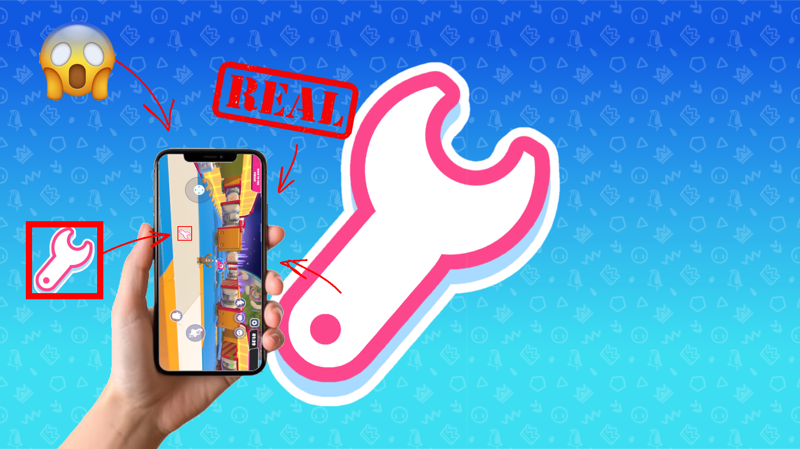
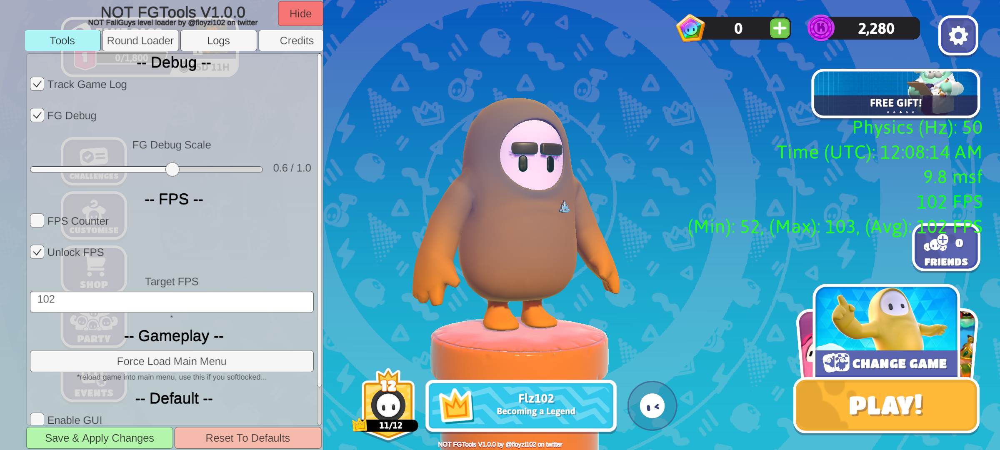
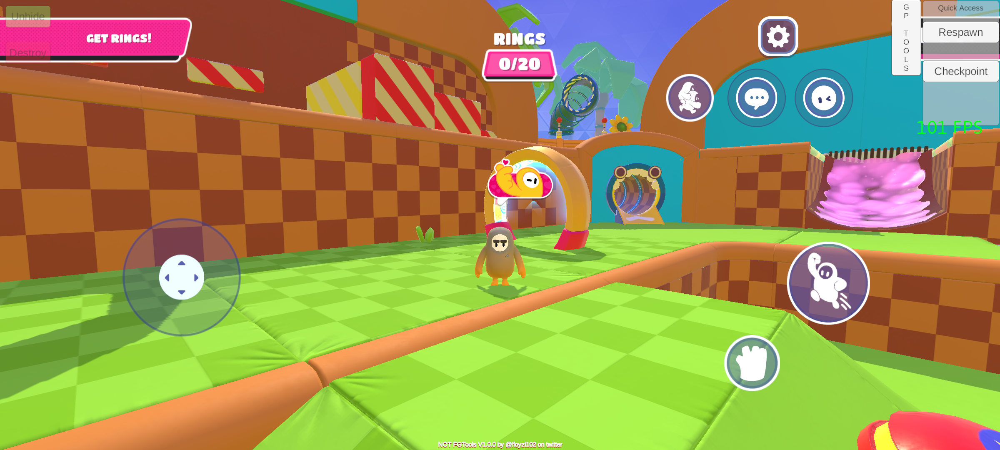
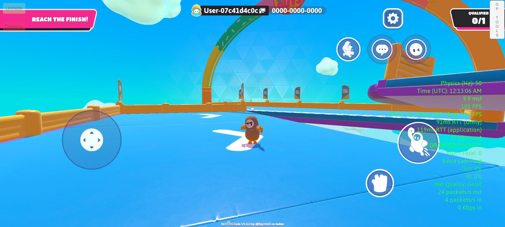

# FGTools Mobile

Mobile version of FGTools

# Features
- Round loader that allows you to load any round in the game in singleplayer
- Ability to set custom FPS limit
- FG Debug (FPS counter, network statistics, etc)
- Unity log tracking
- Some cheats (never included in the release version)

> # Note
>
> - <b>First launch takes up to ten minutes, the game may also crash</b>
> - <b>If you don't want to wait for game resources to download, backup the .obb file inside the Android/obb/com.Mediatonic FallGuys_client/ folder, just restore it after installing the APK</b>
  

# Screenshots

# Building

### Project
- Open it with Visual Studio
- Update the references in the `Lib` folder if needed (to do that use [this version of MelonLoader](https://github.com/LavaGang/MelonLoader/releases/tag/v0.5.7) on the desktop version of the game)
- To build with cheats included set "Cheats" configuration in configuration manager

### UI Bundle
- Download [Unity Hub](https://unity.com/unity-hub)
- Install Unity `2021.3.16f1` with android build tools 
- Open the project and select `Build AssetBundles` in the default context menu
- Your bundle will be in the AssetBundles folder inside the project

# Installing
## Without modifying anything 
- [Download the latest release](https://github.com/floyzi/FGToolsMobile/releases/latest)
- Install it 

## With modifying 
### With access to Android/data folder
- Make sure your game is patched by this version of [LemonLoader](https://github.com/LemonLoader/MelonLoader_057/releases/tag/0.2.0.1) 
- Navigate Android/data/com.Mediatonic.FallGuys_client/files/
- Put the `NOT_FGTools` folder from the Assets folder and `NOT FGTools.dll` that you built into the `Mods` folder 
- Launch the game

### Without access to Android/data folder
- Get Fall Guys APK that is patched via this version of [LemonLoader](https://github.com/LemonLoader/MelonLoader_057/releases/tag/0.2.0.1) 
- Open it with any APK editor (MT Manager or APKTool M on Android or APK Editor Studio on Windows)
- Inside the Assets folder create a folder named `copyToData` there you need to create `Mods` folder and also put the `NOT_FGTools` folder from the Assets folder in this repo 
- Pack the APK and sign it
- Once everything is done, launch the game

# FAQ
### Can I play online with this?
- Yes!
### Can I use this on Emulator?
- LemonLoader doesn't have official emulator support but you can try it
### Will I get banned for this?
- If you're using a version with cheats, probably. If not then you're safe, there's nothing that can ban you
### My game crashes, what do I do!?
- If it was the first launch, just open it again <b>and wait around five or ten minutes sitting on black screen!!</b>
- If the game crashes no matter what then you're out of luck, there is nothing you can do to fix it.

# Credits
- Made using [LemonLoader](https://github.com/LemonLoader/MelonLoader_057)
- [Repinek](https://github.com/repinek) and Toytyis - playtesting
